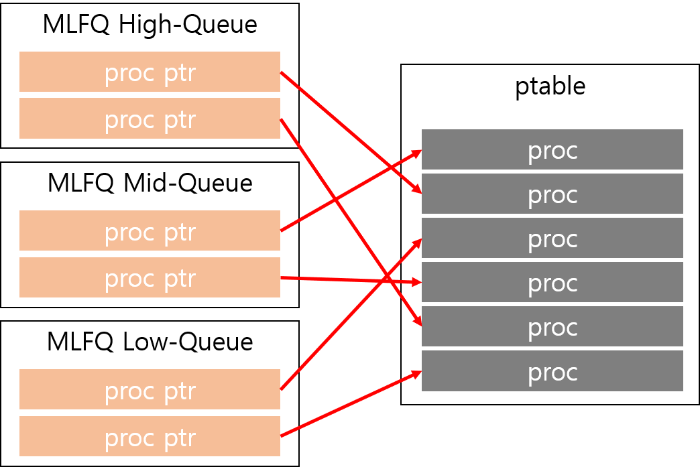

# Design for Project1: MLFQ and Stride Scheduling

## First step: MLFQ

### 1. Data Structure
MLFQ를 구현하기 위해서는 우선 queue 자료구조를 만들어야 한다. 현재 xv6에서는 `ptable.proc`에 `proc` instance를 저장한다. 따라서 MLFQ에서 사용될 queue는 `ptable.proc`에 있는 `proc`의 주소를 저장해야 한다. 이러한 queue를 각 level마다 하나씩 만든다.



각 proc pointer는 상황에 따라 다른 queue로 옮겨지기 때문에 linked list 방식으로 queue를 구현한다.

대락적인 MLFQ 자료형은 다음과 같다.
```c
#define NUM_MLFQ_LEVEL 3

struct {
  proc_queue_t queue[NUM_MLFQ_LEVEL]; // multi-level queue
  int          executed_ticks;        // the number of ticks to which MFLQ scheduler worked
} mlfq_mgr;
```

### 2. Edit `proc` Structure
MLFQ scheduling에 필요한 정보를 각 `proc` 구조체에 담을 필요가 있다. 따라서 다음과 같은 데이터를 `proc`에 추가한다.

```c
struct mlfq_info {
  int level;          // level of queue where this process exists
  int executed_ticks; // the number of ticks to which this process was executed in current level
};
```

### 3. Edit `scheduler` Function
`scheduler` 함수에선 다음에 실행할 process를 선택해 `p` 변수에 넣어주기면 context switch를 수행하도록 되어있다. 따라서 다음에 실행할 process를 선택하는 routine만 MLFQ에 맞게 구현하면 된다. 다만, 선택하는 것까지 `scheduler` 함수 내부에 구현하면 이후 stride와 combine하는 상황에서 함수가 매우 복잡해질 우려가 있어 선택 routine은 별도의 함수 `schedule_choose`로 빼도록 한다. 

또한, boosting을 해야하는 시기가 오면 `mlfq_boost` 함수를 호출해야 한다.

수정된 `scheduler` 함수는 다음과 같다.

```c
p = schedule_choose();
if(p->state != RUNNABLE)
  continue;

c->proc = p;
switchuvm(p);
p->state = RUNNING;

swtch(&(c->scheduler), p->context);
switchkvm();

c->proc = 0;

if(mlfq.executed_ticks >= MLFQ_BOOSTING_INTERVAL)
    mlfq_boost();
```

### 4. Implement `schedule_choose` Function
`schedule_choose` 함수에서 수행해야하는 일은 다음과 같다.

- MLFQ scheduling algorithm에 따라 다음으로 cpu를 가질 process 후보 선택하기.
- 각 process의 priority level 관리하기.
  - process의 `executed_ticks`이 해당 level의 time allot 이상이면 우선순위를 떨어트린다.
  - process의 `executed_ticks`이 해당 level의 time quantum 이상이면 queue에서 빼고 끝에 다시 넣는다.

### 5. Manage `executed_ticks` Fields
- `mlfq.executed_ticks` : `schedule_choose` 함수 내부에서 증가시킴
- `proc::executed_ticks` : trap.c에서 timer interrupt가 발생할 때 증가시킴
  - 정확한 시간을 재어 scheduling 하는 것은 불가능하다고 판단된다.  
    (1 tick보다 작은 단위로 process를 강제로 scheduler에서 yield 할 수 없다.)
  - 최소한 gamer process에 의해 다른 프로세스가 손해 보는 것을 막아야 한다.
  - 따라서 timer interrupt가 발생하여 scheduling된 경우에만 execution counter를 증가시키는 것이 최선으로 사료된다.

### 6. Edit `allocproc` Function
xv6에선 `allocproc` 함수를 통해 새로운 process를 만들어 ptable을 설정한다.
따라서 이 함수에서 MLFQ의 high priority queue에 새로운 process를 넣고 관련 field를 초기화하는 코드를 추가해야 한다.


## Second step: Combine the stride scheduling algorithm with MLFQ

### 1. Data Structure
MLFQ scheduler가 CPU를 최소 20%는 점유하도록 해야하므로 마치 MLFQ scheduler도 프로세스인 것 처럼 취급하기 위해 MLFQ 자료형을 다음과 같이 수정한다.

```c
#define NUM_MLFQ_LEVEL 3
#define MLFQ_CPU_SHARE 20

struct {
  proc_queue_t queue[NUM_MLFQ_LEVEL]; // multi-level queue
  int          executed_ticks;        // the number of ticks to which MFLQ scheduler worked

  double       pass;
} mlfq_mgr;
```

이후 stride scheduler에 뽑힐 process의 pass와 `mlfq_mgr.pass`를 비교해 작은 것을 선택하도록 한다면 MLFQ의 cpu 점유율을 보장할 수 있다.

Stride scheduling에서는 가장 작은 pass를 가진 process를 뽑아야 하므로, MinHeap 자료구조를 이용한다.
대략적인 stride 자료헝은 다음과 같다.

```c
#define STRIDE_TOTAL_TICKETS 100

struct {
  proc_min_heap_t queue;

  double          pass;
} stride_mgr;
```

이때 `pass` field는 가장 최근에 stride scheduler에 의해 선택된 process의 pass를 담는다.
이후 `set_cpu_share` syscall을 이용해 stride scheduling을 적용하도록 하였을 때 해당 process의 pass를 이 값으로 설정하여 초기에 한 process가 stride scheduler를 독점하는 일을 방지한다.

### 2. Edit `proc` Structure
`schedule_choose` 함수에게 해당 process가 stride scheduling으로 동작하는지, mlfq scheduling으로 동작하는지를 알리기 위해 다음과 같은 열거체 변수를 `proc` 구조체에 추가해야 한다.

```c
enum schedule_policy {
  MLFQ,
  STRIDE
};
```

또한, stride, pass 등의 stride scheduling을 위한 정보를 `proc`에 담아야 한다. 따라서 다음과 같은 데이터를 `proc`에 추가한다.

```c
struct stride_info {
  double stride;
  double pass;
};
```

`proc`의 메모리 크기를 줄이기 위해 union을 사용해 다음과 같이 `mlfq_info`와 `stride_info`를 합친다.

```c
union proc_sched_info {
  struct mlfq_info mlfq;
  struct stride_info stride;
};
```

### 3. Edit `schedule_choose` Function
1. `stride_mgr.queue`의 root node의 pass와 `mlfq_mgr.pass`를 비교한다
2. 전자가 크면 `stride_mgr.queue`에서 pop을 수행한 뒤 stride를 더해 pass를 업데이트 한 후 다시 insert한다.
3. 후자가 크면 위에서 구현한 mlfq의 scheduling algoritm대로 수행한다.

### 4. Implement `set_cpu_share` Syscall
1. 해당 syscall이 발생하면 해당 process의 정보에서 `schedule_policy`를 `STRIDE`로 변경한다.
2. stride를 `STRIDE_TOTAL_TICKETS / share`로 설정한다.
3. pass를 `stride_mgr.pass`로 설정한다.
