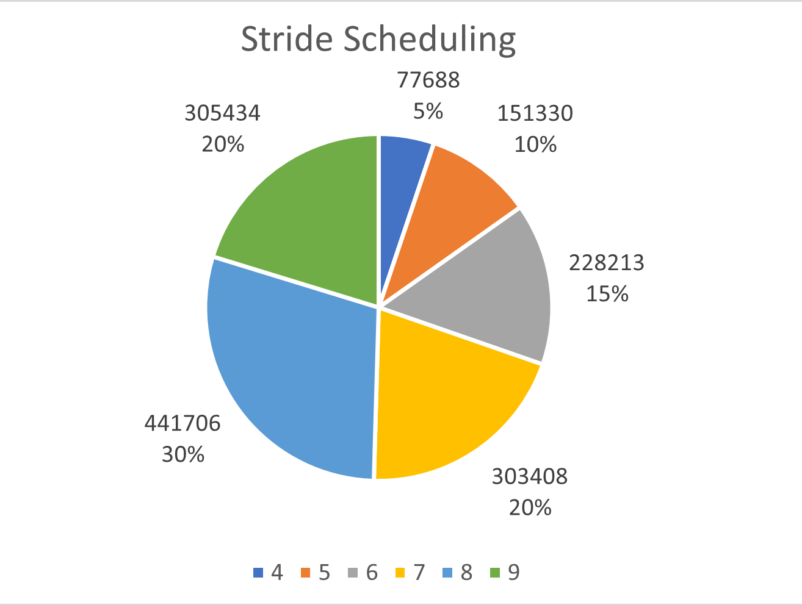

# Implementation for Project1: MLFQ and Stride Scheduling

## 1. Multi Layer Feedback Queue

### A. Data Structure
Design 단계에서는 각 queue 별로의 이동을 효율적으로 하기 위해 linked list 구조를 제안했지만, 동적할당이 없는 xv6 구조상 linked list를 만들어 운용하는 것이 큰 이점이 없어 circular queue를 이용하였다.

### B. `executed_ticks` 관리
Design 단계에선 `executed_ticks`를 time interrupt에서 올리는 방식으로 구현하려 했지만 xv6의 동작을 잘못이해하고 설계했었다. 그러한 방식으로 구현하면 오히려 gamer process가 존재할 때 그렇지 않은 process들이 피해를 보는 상황이 생길 것이다.
따라서 `scheduler` 함수에서 process를 선택함과 동시에 해당 process의 `executed_ticks`를 올리도록 구현하였다.

## 2. Stride

### A. Data Structure
Design 단계에선 MinHeap 자료구조를 이용해 stride scheduler를 구현하고자 하였다.
하지만, pass가 최소인 process가 RUNNABLE하지 않은 경우 그 다음으로 작은 pass를 가지는 process를 선택해야한다. 만약 MinHeap으로 구현한다면 process를 선택하는 작업의 최악 시간 복잡도는 O(nlogn)이 된다. (모든 process가 runnable하지 않은 경우엔 n번 pop 연산을 수행해야 한다.) 그러나, sorted array를 사용한다면 해당 작업의 시간 복잡도는 최악 O(n)이 된다. 따라서 구현에선 sorted array를 사용하였다.

### B. `stride_mgr.pass` 관리
Design 단계에선 `stride_mgr.pass`를 최근 선택된 process의 pass로 하기로 했다. 하지만 그러한 방식으로 구현한다면 다음 두 문제가 발생한다.

1. MLFQ와의 일관성이 사라진다.  
MLFQ scheduler에 stride를 도입에서는 `mlfq_choose` 함수를 main으로 하는 하나의 process 취급하자가 핵심이였다. 그렇기에 `mlfq_choose` 함수가 호출되는 것은 process가 실행되는 것과 같기에 pass를 무조건 올려주게되는데, design대로 구현하면 `stride_choose` 함수는 process와 접점이 없게 된다. 따라서 stride scheduler 역시 마치 `stride_choose` 함수를 main 함수로 하는 process 처럼 취급하여 이러한 비일관성을 해결하는 것이 좋은 design이라 판단되었다.

2. stride scheduler에 등록된 모든 process가 RUNNABLE하지 않으면 system이 freeze 된다.
선택된 process가 없으니 `stride_mgr.pass`의 값이 변하지 않을 것이다. 그러나 `mlfq_mgr.pass`는 계속 증가하니 `stride_choose` 함수만 호출이 될 것이고 `stride_choose` 함수는 아무 것도 선택을 하지 않는 상태가 지속되어 결국 system이 freeze되는 문제가 발생한다.

위 두 가지 문제를 해결하고자 stride scheduler에 등록된 모든 process의 share를 더한 것을 `stride_mgr.share`에 저장한 뒤, `stride_choose` 함수가 호출될 때마다 `stride_mgr.pass`에 stride를 더하는 방식으로 구현하였다.

## 3. Results

### A. MLFQ Scheduling
  
> violet: pid=4, green: pid=5

위 plot은 MLFQ scheduler에서 한 시점에 실행된 process의 종류와 그 시점에서의 process의 level을 나타낸다. 각 level에 맞는 time quantum과 time allotment에 따라 두 process가 정상적으로 scheduling 된 것을 확인할 수 있다. 또한, 100 ticks, 200 ticks에서 모든 process의 level이 0으로 된 것으로 보아 boosting도 정상 작동한 것을 확인할 수 있다.

### B. Stride Scheduling

> pid 4: stride(5% share)  
> pid 5: stride(10% share)  
> pid 6: stride(15% share)  
> pid 7: stride(20% share)  
> pid 8: stride(30% share)  
> pid 9: MLFQ

위 plot은 test program이 동작할 때 각 process가 수행된 횟수와 그 비율을 나타낸다. 위 plot에서 정해진 share만큼 CPU를 점유하는 것을 확인할 수 있다. 또한 9번 pid를 가진 process는 MLFQ scheduler에 의해 scheduling되는데, 20%를 정상적으로 점유하는 것을 확인할 수 있다.
